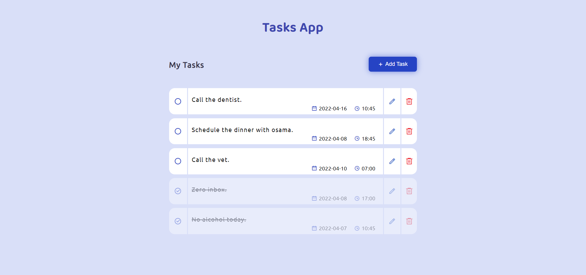

# Tasks Application ✔



> Simple Web App To Manage Your Daily Tasks.

---

### Table of Contents


- [User Story](#📰-user-story)
- [Live Link](#🔗-live-link)
- [How To Use](#📌-how-to-use)
- [Technologies & Tools](#🛠️-technologies-&-tools)
- [Authors](#👪-authors)

---

### 📰 User Story

- As a user, I will be able to show my tasks.
- As a user, I will be able to add new task.
- As a user, I will be able to edit tasks I have.
- As a user, I will be able to delete tasks I have.
- As a user, I will be able to mark task as a completed.

<a href="#tasks-application-✔" style="font-size:14px;">Back To Top</a>
---
### 🔗 Live Link

[Tasks App](https://tasks-app-km.netlify.app/)

<a href="#tasks-application-✔" style="font-size:14px;">Back To Top</a>
---

## 📌 How To Use

#### Installation

```git
    git clone https://github.com/GSG-G11/todo-list-km.git

    cd todo-list-km

    code .

    npm i

    npm run start
```
<a href="#tasks-application-✔" style="font-size:14px;">Back To Top</a>
---

## 🛠️ Technologies & Tools

- HTML, HTML5
- CSS, CSS3
- JavaScript (ES6).
- React Js
- Git & Github
- NPM
- Local Storage

<a href="#tasks-application-✔" style="font-size:14px;">Back To Top</a>
---

## 👪 Authors

- Karam Zomlot - [@karam-zomlut](https://github.com/karam-zomlut)
- Mohammed Heles - [@mo7amedehab97](https://github.com/mo7amedehab97)

<a href="#tasks-application-✔" style="font-size:14px;">Back To Top</a>